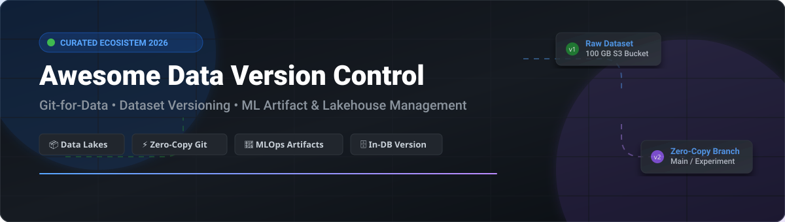

# 📊 Awesome Data Version Control Platform

  
  
  
  
  

## 🚀 Overview & Ecosystem Guide

Welcome to the **Awesome Data Version Control Platform** directory! 🌟 This repository tracks top **SaaS platforms** and **open-source tools** designed for **Data Version Control (DVC)**, dataset management, machine learning artifact tracking, and reproducibility. These production-grade solutions help data scientists, data engineers, and MLOps teams version datasets, machine learning models, and data lakehouses with Git-like semantics (commits, zero-copy branching, tagging, and auditing).

Whether you are building enterprise data lakes on AWS S3 / Delta Lake / Iceberg, managing ML experiment artifacts, or seeking in-database row-level versioning, this curated list covers the leading enterprise SaaS products and high-star open-source frameworks.

---

## 📑 Table of Contents

- [☁️ SaaS / Hosted Platforms](#-saas--hosted-platforms)
- [🔓 Open-Source GitHub Projects](#-open-source-github-projects)
- [🤝 How to Contribute](#-how-to-contribute)
- [💖 Support](#-support)
- [📈 Star History](#-star-history)
- [⚠️ Disclaimer](#%EF%B8%8F-disclaimer)

---

## ☁️ SaaS / Hosted Platforms

> [!NOTE]
> **Market Size & Structure**: The estimated global market size for Data & Model Version Control / MLOps infrastructure is expected to reach **~$5.5 Billion by 2028** (growing at >30% CAGR). The market structure is **moderately fragmented**: category consolidations are emerging (e.g., lakeFS acquiring the DVC team, CoreWeave acquiring Weights & Biases for $1.7B, and JFrog acquiring Qwak for $230M), while specialized point-solutions coexist alongside broad AI cloud platforms.

### 💰 SaaS Platform Comparison & Pricing Matrix

Below is a curated comparison of leading SaaS & managed cloud platforms for data version control and ML artifact management, ordered by company scale (valuation / acquisition value / market cap descending):

| SaaS Platform 🛠️ | Description 📝 | Company Scale (Valuation / Revenue) 📊 | Pricing (Starting Tier) 💵 | Free Tier / Trial Limits 🎁 |
| :--- | :--- | :--- | :--- | :--- |
| **[Weights & Biases Artifacts](https://wandb.ai/)** 🏋️‍♂️ | ML artifact & dataset versioning platform with lineage, aliases, and experiment tracking | **$1.7 Billion** (Acquired by CoreWeave; ~$50M ARR) | **$60/user/month** (Pro Tier) | **Free Forever**: 5 model seats, 5 GB storage, 1 GB Weave data ingestion / mo |
| **[Qwak / JFrog ML](https://www.qwak.com/)** ⚡ | End-to-end MLOps platform with artifact versioning, model registry, & serving | **$230 Million** (Acquired by JFrog) | **$0.30/node-hour** + cloud infrastructure compute costs | **14-day Free Trial** with full feature access and cloud deployment credits |
| **[lakeFS Cloud](https://lakefs.io/)** 🌊 | Managed Git-for-data platform providing zero-copy branching & time travel on object storage | **$43 Million Funding** ($20M Series A lead by Maor Investments) | **$0.05/managed GB/month** or enterprise tier | **15-day Free Trial** with full enterprise governance & zero-copy features |
| **[Iterative / DVC Studio](https://studio.iterative.ai/)** 🎨 | Cloud hub for DVC experiment tracking, dataset versioning, & model pipelines | **$25 Million Funding** (Series A lead by 468 Capital) | **$70/team member/month** (Teams Tier) | **Free Forever**: Single developer account with basic project tracking |
| **[ClearML](https://clear.ml/)** 🎯 | Open-source MLOps platform with dataset versioning, experiment tracking, & orchestration | **$25M – $50M Valuation** (~$4.5M ARR) | **$15/user/month** (Pro Tier) | **Free Forever**: Up to 3 users, 100 GB artifact storage, 1GB metric events, 1M API calls/mo |

---

## 🔓 Open-Source GitHub Projects

The data version control ecosystem boasts a **mature, production-proven open-source standard**. The list below is sorted by **GitHub Stars_Count (Descending)**, featuring official social badges linked directly to each project's stargazers page:

1. **[MLflow](https://github.com/mlflow/mlflow)**  🤖  
   *Open source platform for the machine learning lifecycle, featuring MLflow Model Registry and Artifact Store for versioning datasets and models.*

2. **[Dolt](https://github.com/dolthub/dolt)**  🗄️  
   *Git for Data — MySQL-compatible SQL database with native Git version control semantics (commit, branch, merge, diff) operating at row-level granularity.*

3. **[DVC (Data Version Control)](https://github.com/iterative/dvc)**  📦  
   *Git-like version control system for machine learning projects, datasets, and pipelines. Keeps pointer files in Git while storing large data files in remote object storage.*

4. **[Weights & Biases SDK](https://github.com/wandb/wandb)**  📊  
   *Developer stack for tracking ML code, datasets, and model artifacts with reproducible pipeline lineage.*

5. **[Pachyderm](https://github.com/pachyderm/pachyderm)**  🐘  
   *Data-driven pipeline orchestration with built-in data versioning, data lineage tracking, and Kubernetes-native execution.*

6. **[lakeFS](https://github.com/treeverse/lakeFS)**  🌊  
   *The leading Git-for-data platform for data lakes. Delivers zero-copy branching, atomic commits, time travel, and S3 API compatibility across petabyte-scale object stores.*

7. **[Project Nessie](https://github.com/projectnessie/nessie)**  🦕  
   *Transactional catalog for Apache Iceberg and data lakehouses providing Git-like multi-table branching, tagging, and atomic cross-table commits.*

8. **[ChiveSave Community Backend](https://github.com/CHIVE-AI/chivesave-community-backend)**  🌿  
   *Self-hosted, community-driven AI artifact versioning backend powered by FastAPI, PostgreSQL, and Docker for lightweight metadata persistence.*

---

## 🤝 How to Contribute

Contributions are highly welcome! 🌟 If you know of an awesome SaaS platform or open-source data versioning tool that should be included:

1. **Fork** this repository.
2. Add or update entries in `README.md` keeping formatting consistent.
3. For SaaS entries, include pricing, free tier limits, and company scale details.
4. Submit a **Pull Request** with a brief summary of your changes.

Check out our curated meta-list at **[Awesome-Awesome-Awesome](https://github.com/ishandutta2007/Awesome-Awesome-Awesome)** for more amazing lists!

---

## 💖 Support

If you find this repository helpful, please consider showing your support:

- ⭐ **Star** this repository to help others discover it!
- 🔀 **Fork** it to keep a personal bookmark.
- 📢 **Share** it with your MLOps & Data Engineering community!
- ☕ **Buy me a coffee / Sponsor**: Support ongoing maintenance via the [GitHub Sponsor Dashboard](https://github.com/sponsors/ishandutta2007).

---

## 📈 Star History

---

## ⚠️ Disclaimer

- This is a **community-curated** list and does not constitute formal endorsement.
- Data version control systems manage critical enterprise data; ensure appropriate access security and compliance policies.
- Open-source tools like **lakeFS**, **Dolt**, **DVC**, **MLflow**, and **Nessie** offer complete operational independence without vendor lock-in.
